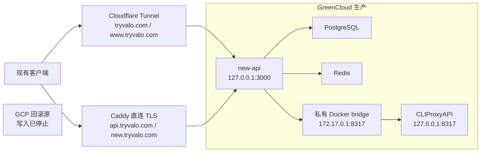

# GreenCloud 迁移执行手册（2026-07-11）

## 目标与边界

将 `new-api`、宿主机版 CLIProxyAPI（CPA）和 CPA keeper 从 GCP 迁至 GreenCloud；镜像只在本地构建为 `linux/amd64`，以不可变镜像包上传到 GreenCloud。CPA 不对公网开放，只有 `new-api` 可以通过私有 Docker 桥接访问它。

后续常规发布、完整迁移、入口切流与回滚统一遵循 [GreenCloud 服务迁移 SOP](greencloud-service-migration-sop.md)；本手册保留本次迁移的事实记录和环境专属细节。

## 正式切换记录（2026-07-12）

- Cutover ID：`new-api-cutover-20260712T001659Z`
- 最终数据库验收：`users|channels|tokens|options|logs = 29|15|86|47|400780`。
- GreenCloud 的 `new-api`、PostgreSQL、Redis 均 healthy；CPA 与其 Docker 私有 bridge 均保持启用，CPA 不对公网开放。
- GCP 写入已停止：`new-api` 与 `cpacodexkeeper` 为 stopped，`cliproxyapi.service` 为 inactive。GCP 保留至少 7 天，作为只读回滚源。
- 回滚命令（仅在确认需要回退时执行）：

  ```bash
  sudo systemctl start cliproxyapi.service
  sudo docker start new-api cpacodexkeeper
  ```

`tryvalo.com` 与 `www.tryvalo.com` 继续由 Cloudflare Tunnel `greencloud-new-api-rehearsal` 转发到 GreenCloud 的 `http://127.0.0.1:3000`。为避开橙云长请求的源站响应时限，`api.tryvalo.com` 与 `new.tryvalo.com` 已于 2026-07-12 10:06（Asia/Shanghai）从 Tunnel CNAME 改为直接 A 记录 `173.249.203.66`，并设置为 `仅 DNS`（灰云）。

GreenCloud Caddy 负责这两个直接入口的 TLS 与反向代理；Let's Encrypt 证书已分别签发成功。Tunnel 配置最终为 version 7；重复的 `new.tryvalo.com` ingress 已清理，只保留一条。

| Hostname | `/api/status` 验收结果 |
| --- | --- |
| `tryvalo.com` | HTTP 200，`server: cloudflare` |
| `www.tryvalo.com` | HTTP 200，`server: cloudflare` |
| `api.tryvalo.com` | HTTP 200，`server: Caddy`，Let's Encrypt TLS |
| `new.tryvalo.com` | HTTP 200，`server: Caddy`，Let's Encrypt TLS |

CPA 仍不经 Cloudflare 暴露；未改动 `cpa.tryvalo.com`、`cpa-test.tryvalo.com`、`test.tryvalo.com`、`greencloud.tryvalo.com` 或根域 MX 邮件记录。

## 当前服务器快照（2026-07-12 18:03 Asia/Shanghai）

本节是切换后的只读现场复核；不记录密码、token、DSN 或完整 `/api/status` 配置。

| 项目 | 当前事实 |
| --- | --- |
| 主机 | `nemo-Phoenix` / `173.249.203.66`；已运行 4 天；根分区 `33G`，已用 `8.2G`（25%） |
| 对外入口 | `caddy.service` active；监听 `*:80`、`*:443`；`api.tryvalo.com` 与 `new.tryvalo.com` 反代至 `127.0.0.1:3000`，上游读写超时均为 `600s`、SSE `flush_interval -1` |
| new-api | 容器 `new-api` healthy；仅发布 `127.0.0.1:3000->3000`；本机 `/api/status` 返回 `success: true` |
| 数据服务 | `new-api-postgres`、`new-api-redis` healthy；数据库监听仅见 `127.0.0.1:5432`，Redis 未发布主机端口 |
| CPA | `cliproxyapi.service` active；CPA 监听 `127.0.0.1:8317`；`socat` 另仅绑定 Docker 网关 `172.17.0.1:8317` |
| keeper | `cpacodexkeeper.service` 为 inactive/dead，Docker 也未见 keeper 容器；不得将其视为已启用 |
| Tunnel | `cloudflared.service` active，仍为根域与 `www` 的 Tunnel 入口提供服务；`api` / `new` 不依赖 Tunnel |
| Compose | 现场可用命令为 `docker compose` v`2.40.3`；后续发布不要假定旧的 `docker-compose` v1 存在 |

防火墙当前只允许公网 `22/tcp`、Caddy 所需 `80/tcp` 与 `443/tcp`；`3000`、`3001`、`5432`、`6379`、`8317` 均有显式拒绝规则。唯一的 CPA 放行规则只允许 `new-api-backend` 网段 `172.18.0.0/16` 经对应 Docker bridge 访问 `172.17.0.1:8317`。

现场还保留一个名为 `new-api-pg-rehearsal-20260711t001802z-greencloud-rehearsal` 的 PostgreSQL 容器，状态为运行中但不是健康检查容器。它是否为保留的迁移证据，应在确认不再需要回滚/核验后另行处理；本次仅记录，不删除。

下文的 rehearsal 记录保留为迁移过程证据。它描述的是正式切换前的状态；当前生产读写入口以上述正式切换记录为准。



## 已完成的 rehearsal

- 以 GreenCloud 独立 PostgreSQL/Redis 口令创建私有环境；现有 GCP 共享口令不复用。
- 从已校验的加密包恢复 PostgreSQL：`public` 32 表，`users=29`、`channels=15`、`tokens=86`、`options=47`、`logs=400517`。
- Redis RDB 已恢复并转换为 AOF；恢复瞬间为 `db0=21`、`db9=1`，启动 `new-api` 后缓存写入使 `db0` 增至 23，`db9` 保持 1。
- `new-api`、PostgreSQL、Redis 均为 healthy；`new-api` 仅监听 `127.0.0.1:3000`。
- CPA 仍仅监听 `127.0.0.1:8317`。两条已确认的 CPA channel（ID 1、32）在 rehearsal 数据库中已改为 `http://host.docker.internal:8317`，没有改动其启停状态。
- Docker 容器到 CPA 的通路已验证为“可达但需要 CPA 认证”（HTTP 401）。CPA 的私有性由 loopback 监听、仅 Docker gateway 的 bridge 监听和 UFW 拒绝公网 `8317/tcp` 共同保证。
- `cloudflared.service` 已连接专用测试 Tunnel；Cloudflare 已自动创建 `greencloud.tryvalo.com` 的 CNAME。已从公网验证 `https://greencloud.tryvalo.com/api/status` 和首页均返回 HTTP 200。该验证不包含管理员登录、真实上游请求、数据写入或 CPA keeper。

## CPA 私有桥接

Docker 的 `host.docker.internal` 指向 Docker 默认桥接网关（当前为 `172.17.0.1`）；它不能直接访问仅绑定在宿主机 loopback 的 CPA。因此使用：

- `ops/greencloud/systemd/cliproxyapi-docker-bridge.service`
- `socat` 仅绑定 `172.17.0.1:8317`，转发到 `127.0.0.1:8317`
- UFW 仅允许 `new-api-backend` 子网访问该绑定地址；公网仍显式拒绝 `8317/tcp`

若 `new-api-backend` 被删除重建，Docker bridge interface 会变化。重新启用 bridge 前，先从真实网络取得 interface 和 subnet，再更新 UFW 规则；不要沿用旧的 `br-*` 名称：

```bash
network_id="$(docker network inspect -f '{{.Id}}' new-api-backend)"
bridge="br-${network_id:0:12}"
subnet="$(docker network inspect -f '{{(index .IPAM.Config 0).Subnet}}' new-api-backend)"
docker0_ip="$(ip -o -4 addr show docker0 | awk '{print $4}' | cut -d/ -f1)"
```

然后按实际 UFW 规则编号删除旧的带 `new-api backend to CPA bridge` 注释的规则，并插入以下同等范围的规则：

```bash
ufw insert 1 allow in on "$bridge" from "$subnet" to "$docker0_ip" port 8317 proto tcp comment 'new-api backend to CPA bridge'
```

完成后必须从 `new-api` 容器验证 `host.docker.internal:8317` 返回认证响应，而不是只检查宿主机 loopback。

## 最终生产迁移窗口

1. 用户确认正式 Cloudflare hostname、维护窗口、切流顺序和通知范围。已存在的 `greencloud.tryvalo.com` 仅可作 rehearsal；此确认前不得改动正式 hostname、DNS、WAF、Access 或 Turnstile。
2. 在 GCP 停止新的业务写入；记录开始时间、GCP 服务/容器状态、Cloudflare 当前配置和回滚负责人。
3. 重新导出七个最终包：CPA 文件、CPA PostgreSQL、keeper runtime、keeper 配置、`new-api` 配置、`new-api` PostgreSQL、Redis RDB。每个包先落到源端磁盘、生成 SHA-256、再用 age 加密。
4. 通过文件传输而非终端输出传送包：优先在 GCP 与 GreenCloud 之间使用 `rsync --partial --append-verify`；若两机无法直连，上传到受控对象存储后校验 SHA-256 再下载。禁止把 dump 流经聊天、复制粘贴或会被截断的命令输出。
5. GreenCloud 验证每个密文 SHA-256；解密/恢复前再次核对包名、时间戳和 cutover ID。恢复 PostgreSQL、Redis、CPA 状态及 keeper runtime，再执行本手册的 rehearsal 校验。
6. 先启动 CPA、私有 bridge、PostgreSQL、Redis、`new-api`；keeper 仅在 dry-run 和 Feishu 通知策略明确后启用。
7. 通过本机管理入口完成管理员登录、CPA channel 解密、`/v1/models`、普通非流式请求、SSE 请求与账单日志的端到端验证。只记录状态码、请求 ID 和计数，不记录 token、DSN 或完整日志。
8. 所有验证通过且用户再次确认后，才将正式 Cloudflare hostname/DNS 灰度切到 GreenCloud；不得把测试 hostname 当作生产切换。观察期间 GCP 保留为回滚目标。

## 回滚与收尾

- 切流失败：恢复原 Cloudflare 指向，不在 GreenCloud 继续接受生产写入；GCP 无需数据回灌即可继续服务。
- 切流后出现数据/账单不一致：立即停止 GreenCloud 写入，回退 Cloudflare，保留 GreenCloud 日志与数据库快照供核对。
- GCP 至少保留 7 天回滚期，且在数据、账单、SSE、Cloudflare 安全策略和 keeper 行为均验收前不得删除。
- 先前 GCP 共享 PostgreSQL/Redis 口令曾出现在不应出现的操作输出中；生产切流完成后应单独执行口令轮换，并更新所有依赖服务。
