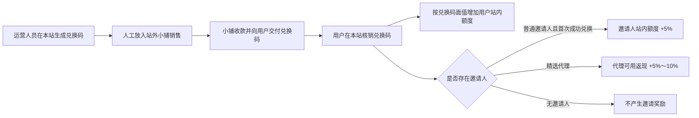

# 兑换码邀请奖励运营规则与功能现状（截至 2026-07-31）

> 文档状态：运营规则确认稿；本文件所在提交已完成实现和本地自动化验证。
>
> 证明边界：功能已在 GreenCloud 独立测试实例完成 PostgreSQL 迁移和匿名访问巡检，但测试镜像来自提交前工作树快照，尚未推送、正式发布或使用目标账号完成业务 E2E，因此不能视为已经上线。

## 1. 当前结论

站外小铺只负责收款和交付兑换码。兑换码由本站生成，再由运营人员人工放入小铺销售；小铺和本站之间不做 API、订单同步或 webhook 对接。

用户在本站成功核销兑换码后：

1. 按兑换码面值增加用户的站内额度。
2. 如果该用户存在邀请人，再根据邀请人类型计算邀请奖励。
3. 普通邀请人与精选代理使用两套不同的奖励账户和结算规则。

当前运营口径如下：

- 普通邀请人：只在每名被邀请用户首次成功兑换时获得一次 `5%` 奖励，直接增加普通邀请人的站内额度，不形成可提现返现。
- 精选代理：被邀请用户每次成功兑换都产生返现，比例由管理员按代理账号独立配置为 `5%～10%`；返现自动进入代理的“可用返现”，可以转为站内额度，也可以申请提现。
- 返佣基数统一按兑换码面值计算，不读取也不依赖小铺的实际售价、折扣或订单金额。

## 2. 站外小铺与本站的边界



本站不需要知道小铺订单号、付款码、支付状态或实际成交价。双方唯一的业务连接媒介是本站生成的兑换码。

这意味着：

- 小铺完成销售，不负责计算或发放奖励。
- 本站只在兑换码成功核销时增加额度并计算奖励。
- 未兑换、兑换失败、过期或已使用的兑换码不产生奖励。
- 运营人员即使按折扣价售出兑换码，奖励仍按兑换码面值计算。

## 3. 邀请人规则矩阵

| 规则 | 普通邀请人 | 精选代理 |
| --- | --- | --- |
| 身份来源 | 存在有效邀请关系，但未被管理员设为精选代理 | 管理员为指定账号开通精选代理 |
| 奖励触发 | 每名被邀请用户的首次成功兑换 | 被邀请用户的每次成功兑换 |
| 奖励比例 | 固定 `5%` | 按代理账号独立配置 `5%～10%` |
| 计算基数 | 兑换码面值 | 兑换码面值 |
| 奖励去向 | 直接增加邀请人的站内额度 | 自动增加代理的“可用返现” |
| 转为站内额度 | 已直接到账，无需再次转换 | 代理可以主动转换 |
| 申请提现 | 不支持 | 支持，且可按账号单独关闭提现权限 |
| 有效期 | 对每名被邀请用户只奖励一次 | 长期有效；代理启用期间持续参与 |
| 记录 | 保留首次奖励记录 | 保留每笔返现、比例快照、转换和提现记录 |

当前默认采用互斥规则：如果邀请人是已启用的精选代理，则只执行精选代理规则，不再叠加普通邀请人的首次 `5%` 奖励。这样可以避免同一笔兑换产生两次邀请成本；如后续决定允许叠加，需要作为一次新的运营规则变更处理。

## 4. 普通邀请人的首次奖励

“首次”指同一名被邀请用户第一次成功核销有效兑换码。失败尝试不占用首次资格。

示例：

1. 用户 B 通过普通邀请人 A 的邀请关系注册。
2. B 首次成功兑换面值 `$100` 的兑换码。
3. B 的站内额度增加 `$100`。
4. A 的站内额度直接增加 `$5`。
5. B 后续再次兑换任何兑换码，A 都不再因 B 获得普通邀请奖励。

普通邀请人的这笔 `$5`：

- 属于站内额度，不称为“返现”或“可用返现”。
- 可以直接用于站内消费。
- 不进入提现账户，也不能申请提现。
- 必须形成独立记录，能够追溯到被邀请用户和其首次成功兑换。

## 5. 精选代理的永久返现

管理员可以把特定账号设为精选代理，并为每个代理独立配置：

- 是否启用代理返现。
- 返现比例，范围为 `5%～10%`。
- 是否允许申请提现。

示例：

1. 精选代理 C 的返现比例为 `8%`。
2. C 邀请的用户 D 成功兑换面值 `$100` 的兑换码。
3. D 的站内额度增加 `$100`。
4. C 的“可用返现”自动增加 `$8`。
5. D 下一次再兑换 `$100`，C 再获得 `$8`。

每次兑换都要保存当时的比例快照。管理员后续修改代理比例时，只影响修改后的新兑换，不重新计算历史记录。

“永久返现”表示代理关系不按首充结束，在代理账号保持启用时，被邀请用户后续的每次成功兑换都继续产生返现。管理员仍可停用代理；停用只影响后续兑换，不删除或改写历史记录。

## 6. 可用返现、转换和提现

精选代理返现不需要运营人员逐笔点击“确认返现”。兑换成功本身就是返现确认事件，系统应在同一业务事务中自动创建返现记录并增加“可用返现”。

代理可以选择：

### 6.1 转为站内额度

代理提交转换金额后：

1. 扣减等额“可用返现”。
2. 增加等额站内额度。
3. 保存转换记录。

转换完成后不可再对同一金额申请提现。

### 6.2 申请提现

提现不由本站直接调用支付渠道，而是申请加线下付款确认：

```text
可用返现
  └─ 提交提现申请 → 待付款
       ├─ 管理员线下转账并确认 → 已付款
       └─ 管理员拒绝 → 金额退回可用返现
```

- 代理申请时，申请金额从“可用返现”转入“提现处理中”，避免重复使用。
- 管理员完成站外转账后，点击“确认已付款”，申请变为“已付款”。
- 管理员拒绝申请时，冻结金额完整退回“可用返现”。
- 申请金额、申请时间、代理备注、管理员备注、审核人和处理时间都要保留。

## 7. 邀请人和管理员可查看的记录

邀请人端至少需要看到：

- 自己直接邀请了哪些账号。
- 每个被邀请账号的成功兑换次数和累计兑换面值。
- 每笔成功兑换的时间和面值。
- 该笔兑换使用的奖励类型、比例和奖励金额。
- 奖励最终进入站内额度还是可用返现。
- 精选代理的可用返现、已转站内额度、提现处理中和已提现汇总。

管理员端需要看到全部邀请关系、兑换奖励、代理配置、转换和提现记录，并能按邀请人、被邀请人、时间和状态查询。

邀请人端不展示兑换码明文、小铺订单信息、付款信息或被邀请人的其他敏感资料。

## 8. 当前代码现状

截至 `2026-07-31`，最终规则已经在本文件所在提交完成实现。下表描述的是该提交及 GreenCloud 测试实例的实际状态，不是已推送或正式上线状态。

| 能力 | 当前工作树状态 | 关键实现 |
| --- | --- | --- |
| 兑换码核销 | 已实现 | 核销时校验面值边界，并通过状态 CAS 保证同一兑换码只能成功一次；用户额度和邀请奖励在同一数据库事务内处理 |
| 普通邀请人首次奖励 | 已实现 | 每名受邀用户首次成功兑换时，按面值固定计算 `5%`，直接增加邀请人的站内额度；后续兑换不再重复奖励 |
| 精选代理返现 | 已实现 | 管理员可按账号配置启用状态、`5%～10%` 比例及提现权限；启用期间每次兑换按当时比例生成返现和比例快照 |
| 身份互斥 | 已实现 | 已启用精选代理只走精选代理返现；普通首次 `5%` 不叠加 |
| 独立返现账户 | 已实现 | 精选代理的可用返现、提现处理中、累计转换和累计提现与普通站内额度分开记录 |
| 转为站内额度 | 已实现 | 扣减代理可用返现、增加等额站内额度并保存转换记录 |
| 提现申请和线下付款确认 | 已实现 | 申请时冻结金额；管理员可确认已线下付款，或拒绝并把冻结金额退回可用返现 |
| 邀请人记录 | 已实现 | 钱包页可查看本人邀请账号、兑换次数与面值、逐笔兑换、奖励、转换和提现记录；历史代理停用后仍可查看和使用已经产生的返现 |
| 管理员记录和操作 | 已实现 | 新增 `/affiliates` 管理页，可配置代理、分页查看邀请关系、兑换、奖励、转换和提现，并按现有界面提供关键词或状态筛选 |
| 多语言和路由 | 已实现 | 用户端和管理员端已接入路由，并补齐 `en`、`zh`、`zh-TW`、`fr`、`ja`、`ru`、`vi` 文案 |

主要核验入口：

- `model/redemption.go`：兑换码 CAS 核销、用户额度和邀请奖励的事务入口。
- `model/affiliate_cashback.go`：普通首次奖励、精选代理返现、查询、转换和提现账务。
- `controller/affiliate_cashback.go`、`router/api-router.go`：用户端和管理员端接口及权限边界。
- `web/src/features/wallet/`：邀请人汇总、记录、返现转换和提现申请界面。
- `web/src/features/affiliates/`：管理员代理配置、全局记录和提现审核界面。

本次功能新增了 `27` 个后端顶层测试函数和 `18` 个前端行为/API 测试。覆盖重点不是单纯提高覆盖率，而是锁定以下业务风险：

- 兑换与奖励：兑换码只能核销一次；普通邀请人每名受邀用户只奖励首次 `5%`；精选代理每次兑换按比例快照返现；两种身份不叠加。
- 账务安全：非法金额不改变账本；返现转换保持原子性；用户额度溢出时整体回滚；并发提现不能超额冻结；同一提现只能被支付或拒绝一次。
- 生命周期：停用代理后新兑换回到普通首次奖励规则，但历史可用返现、转换、提现和重新启用后的余额都不能丢失。
- 数据隔离：邀请人只能查询自己的受邀账号、兑换和提现记录；分页、状态筛选和账号脱敏保持有效。
- 权限和输入：未登录请求、普通管理员与 Root 的角色边界、非法用户 ID、`5%～10%` 比例、金额边界和 Unicode 备注长度均有回归测试。
- 前端行为：普通邀请人与精选代理展示差异、合规开关、详情分页与标签切换、提现成功/失败/提交中状态、管理端代理配置和线下付款二次确认均有测试。

本地验证结果：

- `GOCACHE=/tmp/new-api-go-build go test ./...`：通过。
- `GOCACHE=/tmp/new-api-go-build go test ./model ./controller ./router -count=1`：通过，核心模型、接口和路由测试以禁用结果缓存的方式再次执行。
- 5 个返佣前端测试文件合并执行：通过，`18 pass / 0 fail`。
- `bun run typecheck`：通过。
- 当前工作树中本功能涉及的 TypeScript/TSX 文件定向 `oxlint` 与 `oxfmt --check`：通过，无 error 或 warning。
- `bun run build`：通过，并生成 `/affiliates` 路由。
- `git diff --check`：通过。
- `bun run lint`：整库仍失败，失败项来自本功能未修改的既有文件；本功能涉及文件已通过定向 lint。

当前仍未完成：

- 当前提交尚未推送远端或正式发布。
- 后端账务与接口测试使用本地 SQLite；GreenCloud 测试库已完成 PostgreSQL 迁移，但尚未对 MySQL 执行实际迁移，也未完成 PostgreSQL/MySQL 并发验证。
- GreenCloud 测试实例使用提交前的 dirty 镜像快照，尚未用本文件所在提交重新构建并替换。
- 前端组件测试运行在 `happy-dom`，尚未完成真实浏览器 E2E。
- 未使用目标环境真实账号完成邀请、两次兑换、转余额和提现审核的端到端联调。
- 因此当前只能表述为“代码已实现并通过自动化验证，测试实例可访问”，不能表述为“已经上线”。

兑换码核销、返现转换和提现申请目前仍受站内支付合规确认开关控制。上线前需要确认该开关在当前运营模式下的启用方式，但不需要、也不应把站外小铺接成本站支付渠道。

## 9. 实施验收口径

开发完成至少要通过以下业务验收：

1. 普通邀请人：被邀请用户首次成功兑换 `$100` 后，邀请人站内额度只增加 `$5`；第二次兑换不再增加。
2. 精选代理：按账号配置 `5%～10%`，被邀请用户每次成功兑换都自动产生一条返现记录。
3. 身份互斥：精选代理不会同时获得普通首次 `5%`。
4. 比例快照：修改代理比例不改历史，新兑换使用新比例。
5. 幂等与并发：同一兑换码只能成功一次，也只能产生一次对应奖励。
6. 可见性：邀请人能看到自己邀请的账号和兑换金额，不能看到其他邀请人的数据。
7. 转换守恒：可用返现减少多少，站内额度就增加多少，并保留记录。
8. 提现守恒：申请时冻结，确认付款后结清，拒绝后完整退回可用返现。
9. 边界隔离：全流程不依赖小铺 API、订单号或实际成交价。
10. 发布证明：后端测试、前端联调和目标环境验证分别通过后，才能宣称功能已上线。

## 10. 尚待确认的运营参数

以下事项尚未形成最终规则，不应由开发自行猜测：

- 已核销兑换码发生售后或退款时，是否以及如何冲正站内额度和邀请奖励。
- 功能上线前已经发生的历史兑换，是否补算普通首次奖励或精选代理返现。
- 提现最低金额、申请频率、手续费、收款资料和处理时效。
- 金额不足最小站内额度单位时的取整方式。
- 邀请人端展示完整账号还是脱敏账号。

这些参数确认前，可以完成基础数据结构和主流程设计，但不能把默认值包装成已确认的运营政策。
