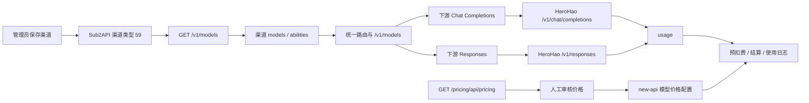

# HeroHao Sub2API 渠道迁移手册

本文用于把 `https://sub2.herohao.top` 接入 new-api 的测试或正式环境，并在迁移后核对模型、Responses 接口和计费。文档不包含任何上游或下游密钥；密钥只能通过部署环境的密钥管理或管理后台填写。

## 结论

HeroHao 当前返回标准 OpenAI 兼容协议，可以直接使用现有 **Sub2API（渠道类型 59）**，不需要修改 Go 代码，也不需要 Advanced Custom。已验证的上游接口包括：

- `GET /v1/models`：标准模型列表，返回 21 个模型；
- `POST /v1/chat/completions`：返回标准 Chat Completions 和 `usage`；
- `POST /v1/responses`：返回 `object: "response"`、`status: "completed"`、`output` 和 `usage.input_tokens/output_tokens/total_tokens`。

当前代码的“从上游获取”只负责同步渠道模型列表；HeroHao 的价格页不会自动写入 new-api 的模型价格配置。价格需要先从价格接口读取，再通过管理后台的模型价格设置或受控脚本导入。

## 架构图



## 渠道配置

在测试或正式环境的“渠道”页面新建渠道：

| 字段 | 值 |
| --- | --- |
| 类型 | `Sub2API`（类型编号 59） |
| 名称 | 例如 `HeroHao-国模-测试` |
| API 地址 | `https://sub2.herohao.top` |
| API 密钥 | 上游提供的 Key（不要提交到 Git） |
| 分组 | `default`，或按现有路由约定填写 |
| 模型 | 点击“从上游获取”，确认加载 21 个模型 |

API 地址不要带 `/v1`。系统会根据请求格式拼接路径；填成 `https://sub2.herohao.top/v1` 可能导致 `/v1/v1/models`。

保存后执行一次渠道测试，并在渠道详情确认模型列表和状态均为启用。若上游模型发生增删，可使用“检测上游模型变更”后再人工应用；不要在第一次接入时直接删除本地模型。

## 价格导入规则

价格接口：

```text
GET https://sub2.herohao.top/pricing/api/pricing
```

接口声明的单位是：

- `token.*`：元 / 百万 Token；
- `request.*`：元 / 次。

本项目约定把接口返回的 `CNY` 数值直接当作 new-api 的 `credit` 数值，**不做汇率换算**。只转换“单位说明”，不转换数值。

### Token 价格字段映射

对 `token.models[]` 逐个按模型名匹配：

| HeroHao 字段 | new-api 含义 |
| --- | --- |
| `model` | 模型名（必须与渠道模型完全一致） |
| `prices.input.official` | 输入 Token 价格（对外售价） |
| `prices.output.official` | 输出 Token 价格（对外售价） |
| `prices.cacheRead.official` | 缓存读价格（对外售价） |
| `prices.cacheWrite.official` | 缓存写价格（对外售价）；缺失时按上游指南记为 0 |
| `enabled` | 是否允许导入/启用 |
| `manualOverride` | 人工覆盖标记；为 true 时不要用同步结果覆盖 |
| `tiers` | 上下文长度分档；导入前必须检查区间和价格单调性 |

建议第一次只导入一个 Token 计费模型（例如 `deepseek-v4-flash-0731`），先验证 Responses 的 usage 和额度变化，再批量导入其余模型。

### 按次价格

`request.rules[]` 是按次计费规则，字段含义如下：

- `models`：适用模型；
- `providerKeys`：适用上游 Key；
- `baseSelling`：基础每次价格；
- `tiers[].minTokens/maxTokens/selling`：按 Token 区间的每次价格；
- `enabled`：规则开关。

当前价格数据存在需要人工复核的异常，不能无审查地全量导入：

- `glm-5.2` 的基础价与第一档 tier 不一致；
- `Kimi-K2.6`、`deepseek-v4.1-flash` 存在高档价格低于低档价格的区间；
- `upstream:hy4-preview` 有启用规则但 selling 为空；
- 部分模型标记 `manualOverride=true`。

遇到这些情况，先保留人工配置或禁用该规则，并在价格核对表中记录原因。

## 测试验收

### 1. 创建下游测试 Key

在测试环境管理后台创建一个临时下游 API Key，给足够但有限的测试额度，并记录：

- Key 名称或末四位（不要记录完整 Key）；
- 测试用户/分组；
- 请求前 quota；
- 创建时间。

测试完成后禁用或删除该测试 Key，避免被其他流量使用。

### 2. 验证模型列表

```bash
export NEW_API_BASE='https://test.tryvalo.com'
export NEW_API_KEY='从测试后台临时复制，勿写入脚本或日志'
curl -sS "$NEW_API_BASE/v1/models" \
  -H "Authorization: Bearer $NEW_API_KEY" \
  | jq '.data | length, .[].id'
```

应能看到 HeroHao 渠道启用的模型。若没有模型，先检查渠道状态、分组、模型同步结果和缓存刷新。

### 3. 验证 Chat Completions

```bash
curl -sS "$NEW_API_BASE/v1/chat/completions" \
  -H "Authorization: Bearer $NEW_API_KEY" \
  -H 'Content-Type: application/json' \
  -d '{
    "model": "deepseek-v4-flash-0731",
    "messages": [{"role": "user", "content": "只回复 OK"}],
    "stream": false
  }' | jq '{id,model,usage,choices: [.choices[]?.message?.content]}'
```

### 4. 验证 Responses

```bash
curl -sS "$NEW_API_BASE/v1/responses" \
  -H "Authorization: Bearer $NEW_API_KEY" \
  -H 'Content-Type: application/json' \
  -d '{
    "model": "deepseek-v4-flash-0731",
    "input": "只回复 OK"
  }' | jq '{id,object,status,model,usage,output}'
```

验收条件：`object` 为 `response`，`status` 为 `completed`，存在 `output`，且 `usage.total_tokens` 等于输入和输出 Token 之和。若使用流式请求，还要确认事件流能正常结束并最终产生 usage。

### 5. 核对计费

请求前后分别记录测试用户 quota，并在使用日志中按 request id 核对：

```text
实际扣减 = 输入 Token × input credit / 1,000,000
        + 输出 Token × output credit / 1,000,000
        + 缓存读/写 Token × 对应 cache credit / 1,000,000
```

如果只配置输入/输出价格，缓存字段应明确配置为 0 或沿用系统默认值，不能留有不确定的隐式覆盖。Responses 和 Chat Completions 应使用同一个模型价格身份；不要通过模型别名绕过价格配置。

### 6. 本次测试环境实测（2026-09-12）

本次在 `https://test.tryvalo.com` 完成了以下配置和验证：

- 渠道：`HeroHao-国模-测试`，渠道类型 `Sub2API`（类型编号 59），渠道 ID `35`，分组 `default`，Base URL 为 `https://sub2.herohao.top`；
- 上游 `/v1/models` 同步 21 个模型，`deepseek-v4-flash-0731` 在下游 `/v1/models` 中可见，并声明支持 `openai`、`openai-response` 等端点；
- 21 个模型均已保存为 `tiered_expr`；其中 4 个 DeepSeek 模型已按北京时间配置 `peak` / `off_peak` 两档，其余模型使用当前快照的普通时段价格。`deepseek-v4-flash-0731` 平时为输入 `0.08`、输出 `0.32`、缓存读取 `0.0016`、缓存写入 `0`，高峰为输入 `0.16`、输出 `0.64`、缓存读取 `0.0032`、缓存写入 `0`（按上游 CNY 数值直接填入 credit，不做汇率换算）；
- Chat Completions 返回 HTTP 200，`usage` 为 `prompt_tokens=33`、`completion_tokens=31`、`total_tokens=64`；
- 非流式 Responses 返回 HTTP 200，`object=response`、`status=completed`，`usage` 为 `input_tokens=33`、`output_tokens=33`、`total_tokens=66`；
- 流式 Responses 返回 `text/event-stream`，收到 `response.completed`，最终状态为 `completed`，usage 为 `input_tokens=33`、`output_tokens=25`、`total_tokens=58`；
- 使用日志生成 2 笔非流式和 4 笔流式消耗记录，显示模型、渠道、令牌、Token 数和价格档位均正确；非流式两笔合计费用约 `$0.000026`，页面当前时段累计用量显示约 `$0.000074`（流式调试请求包含重复读取事件流的验证请求）；
- 另用此前未配置价格的 `MiniMax-M3` 创建临时 Key 做 Responses 验证：HTTP 200，`status=completed`，usage 为 `input_tokens=181`、`output_tokens=2`、`total_tokens=183`；额度从 `100000000` 减少到 `99999984`，使用日志 quota 为 `16`，`billing_mode=tiered_expr`、`matched_tier=base`、`request_path=/v1/responses`、`use_channel=["35"]`；验证后已删除 Key。未在仓库、文档或日志中保存完整密钥。

本次批量导入的是价格接口当前快照中的普通 Token 价格，并将 4 个 DeepSeek 模型的工作日高峰时段 tiers 转换为北京时间请求条件表达式；其他模型的时段 tiers 尚未转换。正式迁移前应按“价格导入规则”逐模型审核是否需要保留时段差异，并保存新的价格快照。

## 正式环境迁移

1. 导出测试环境已验收的渠道字段：类型、名称、Base URL、分组、模型、状态和价格配置；密钥单独通过正式环境密钥流程填写。
2. 在正式环境创建同类型 Sub2API 渠道，Base URL 保持 `https://sub2.herohao.top`，填入正式上游 Key。
3. 点击“从上游获取”，确认模型数量与测试环境一致，再按审核后的价格表导入。
4. 先用正式环境临时下游 Key 做一次 `/v1/models`、Chat、Responses 小额请求。
5. 对照请求日志、usage、quota 和上游用量完成四项核对后，再开放给正式分组。
6. 迁移后保留渠道变更记录和价格快照，便于定位上游价格变化。

## 回滚

- 立即将 HeroHao 渠道状态设为禁用，停止新流量；
- 保留已产生的使用日志和订单，不回写或手工冲正 quota；
- 恢复迁移前的模型列表和价格快照；
- 若仅是上游 Key 失效，替换 Key 后先做单渠道测试，再恢复状态；
- 若是价格异常，锁定受影响模型，禁止继续导入价格，不要删除其他模型配置。

## 已验证与待复核

已验证：上游 `/v1/models`、`/v1/chat/completions`、`/v1/responses` 均为可用的标准接口；模型列表与价格接口模型名一致；Sub2API 渠道类型具备 OpenAI/Responses 路由能力。

正式迁移前仍需在目标环境重新复核：渠道保存结果、下游 Key 权限、流式 Responses、实际 quota 扣减、使用日志，以及价格接口是否发生变化。上游价格页不是 new-api 的自动同步源，价格变更必须重新审核后导入。

## 当前上游价格快照（仅供导入审核）

抓取时间：`2026-09-12T03:51:05.479Z`。以下为 `token.models[]` 的 CNY selling 值，按本项目约定可直接作为 credit 数值；本表与本次 21 个模型的测试环境导入一致。

| 模型 | 输入 | 输出 | 缓存读 | 缓存写 | manualOverride |
| --- | ---: | ---: | ---: | ---: | --- |
| `deepseek-v4-flash-0731` | 0.0800 | 0.3200 | 0.0016 | 0.0000 | `true` |
| `deepseek-v4-flash-vision-exp` | 0.1200 | 0.4800 | 0.0024 | 0.0000 | `false` |
| `deepseek-v4-pro-0813` | 0.3600 | 1.0800 | 0.0120 | 0.0000 | `true` |
| `deepseek-v4.1-flash` | 0.1200 | 0.4800 | 0.0024 | 0.0000 | `false` |
| `glm-5.1` | 0.6400 | 2.2400 | 0.1600 | 0.0000 | `true` |
| `glm-5.2` | 0.6400 | 2.2400 | 0.1600 | 0.0000 | `true` |
| `glm-5.3` | 0.6400 | 2.2400 | 0.1600 | 0.0000 | `true` |
| `glm-5.3-flash` | 0.0960 | 0.3400 | 0.0280 | 0.0000 | `false` |
| `hy3` | 0.0800 | 0.3200 | 0.0200 | 0.0000 | `true` |
| `hy4-preview` | 0.4800 | 1.4400 | 0.0240 | 0.0000 | `true` |
| `kimi-k2.6` | 0.5200 | 2.1600 | 0.0880 | 0.0000 | `true` |
| `kimi-k2.7-code` | 0.5200 | 2.1600 | 0.1040 | 0.0000 | `true` |
| `kimi-k3` | 1.6000 | 8.0000 | 0.1600 | 0.0000 | `true` |
| `mimo-v2.5` | 0.0800 | 0.1600 | 0.0080 | 0.0000 | `true` |
| `mimo-v2.5-pro` | 0.2480 | 0.4880 | 0.0080 | 0.0000 | `true` |
| `MiniMax-M2.7` | 0.1680 | 0.6720 | 0.0336 | 0.2104 | `true` |
| `MiniMax-M2.7-highspeed` | 0.3360 | 1.3440 | 0.0336 | 0.2104 | `true` |
| `MiniMax-M3` | 0.1680 | 0.6720 | 0.0336 | 0.0000 | `true` |
| `qwen3.7-max` | 1.1600 | 3.4600 | 0.2400 | 1.4400 | `false` |
| `qwen3.8-flash` | 0.0770 | 0.2600 | 0.0160 | 0.0960 | `false` |
| `qwen3.8-max` | 1.1600 | 3.4600 | 0.2400 | 1.4400 | `false` |
