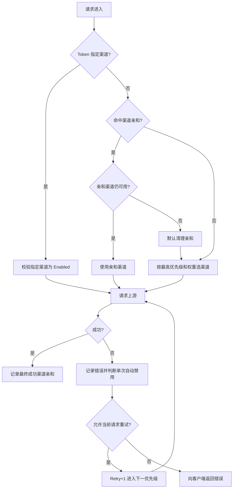
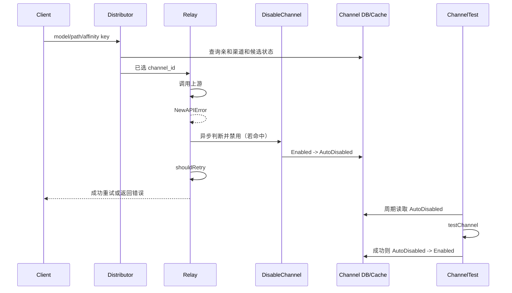

# new-api 渠道故障隔离与恢复链路审计

## 1. 范围

- 目标：梳理同步 Relay 请求的渠道选择、渠道亲和、失败重试、自动禁用、后续换路和自动恢复链路。
- 分析类型：L3 业务链级静态审计，并附本轮正式环境只读配置快照。
- 代码基线：`main@f3afd64480c2`，审计时间 `2026-08-03`。
- 证据置信度：代码链路为高；正式环境配置为本轮只读快照；上游实际错误映射仍可能受具体 adaptor 影响。
- 不覆盖：异步任务、Midjourney/Suno/视频任务的完整重试语义，以及生产部署或配置修改。

## 2. 业务职责与入口定位

new-api 当前没有一个独立的、按“失败次数 + 时间窗口 + 冷却时间”工作的渠道熔断器。用户感知到的“熔断”实际上由以下机制组合而成：

1. `middleware.Distribute`：选定初始渠道，优先处理指定渠道和渠道亲和。
2. `controller.Relay`：调用上游，失败后判断是否允许当前请求重试。
3. `processChannelError -> service.ShouldDisableChannel`：判断单次错误是否应自动禁用渠道。
4. `service.DisableChannel -> model.UpdateChannelStatus`：把渠道或多 Key 中的当前 Key 标记为自动禁用。
5. 后续请求重新选渠道：已禁用渠道会从候选集合中移除；失效亲和可被清理。
6. `channel_test` 系统任务：定时测试渠道，成功后把自动禁用渠道恢复为启用。

`service/error_monitor.go` 虽然包含窗口、阈值和冷却，但它只聚合错误日志并发送飞书告警，不调用 `DisableChannel` 或 `UpdateChannelStatus`，因此不是路由熔断执行器。

## 3. 主流程概述

### 3.1 请求进入与初始选路

1. `/v1/*` 路由先执行 `TokenAuth`、限流和 `middleware.Distribute`，然后进入 `controller.Relay`。
2. 如果 Token 指定了渠道，直接加载该渠道；渠道非启用状态则拒绝请求。
3. 未指定渠道时，先按渠道亲和规则计算缓存 Key 并查询历史渠道。
4. 亲和命中的渠道只有在仍启用、支持当前路径/模型、满足分组计费约束时才可使用。
5. 亲和不可用且 `keep_on_channel_disabled=false` 时，删除当前亲和缓存。
6. 没有可用亲和渠道时，按最高优先级选候选；同优先级内再按权重随机。

### 3.2 上游失败后的两条独立决策

上游失败后会依次发生两件彼此独立的事情：

1. **是否自动禁用渠道**：`processChannelError` 调用 `ShouldDisableChannel`，满足条件时异步执行 `DisableChannel`。
2. **当前请求是否重试**：`shouldRetry` 根据亲和规则、错误属性、剩余次数、指定渠道和状态码判断。

自动禁用不等于当前请求重试；当前请求重试也不要求渠道已经被禁用。

### 3.3 后续请求换路与恢复

1. 非多 Key 渠道自动禁用后，状态变为 `ChannelStatusAutoDisabled`，并从启用能力/缓存候选中移除。
2. 多 Key 渠道优先只禁用本次使用的 Key；所有 Key 都不可用时，整个渠道才进入自动禁用状态。
3. 后续请求发现亲和渠道已禁用时不会继续使用它；根据配置可清理亲和缓存，然后选择其他启用渠道。
4. 自动渠道测试成功后，仅当渠道原状态为自动禁用且开启自动恢复，才调用 `EnableChannel`。
5. 渠道恢复后重新进入候选集合；但已经在备用渠道上重写的亲和缓存不会因低价渠道恢复而自动回切，只能等待 TTL、主动清理或新会话重新选路。

## 4. 逐步逻辑拆解

### 4.1 初始渠道选择

- 行为：`middleware.Distribute` 先处理 Token 指定渠道，再尝试亲和渠道，最后进入优先级/权重选择。
- 输入：请求模型、路径、用户/Token 分组、指定渠道 ID、亲和 Key。
- 输出：Gin Context 中的渠道 ID、类型、Key、Base URL、模型映射等。
- 副作用：亲和命中时记录 `channel_affinity` 管理日志信息和 `SkipRetryOnFailure`。
- 失败条件：指定渠道不存在/已禁用，或分组内没有支持模型和路径的可用渠道。

优先级和权重语义：

- `retry=0` 只选择最高优先级。
- `retry=1` 选择第二高的唯一优先级，以此类推。
- 同一优先级中才按权重随机。
- 重试次数超过优先级数量时，会落在最低优先级，不保证一定避开已经使用过的渠道。

### 4.2 渠道亲和

默认 Codex 规则匹配 `gpt-* + /v1/responses`，从 `prompt_cache_key` 取亲和值；默认 Claude 规则匹配 `claude-* + /v1/messages`，从 `metadata.user_id` 取值。两条默认规则均设置 `SkipRetryOnFailure=true`。

亲和缓存的默认 TTL 为 3600 秒，默认 `SwitchOnSuccess=true`：成功请求结束后会把最终成功渠道写回亲和缓存。如果低价渠道自动禁用后，某个已有会话成功走了高价备用渠道，该会话通常会继续亲和高价渠道直到缓存过期或被清理。

### 4.3 当前请求重试

`shouldRetry` 的门禁顺序如下：

1. 没有错误：不重试。
2. 本次使用的亲和规则要求失败后不重试：立即停止。
3. `channel:*` 类渠道内部错误：允许重试，但仍受 Relay 外层 `RetryTimes` 循环上限约束。
4. 错误自身带 `skipRetry`：停止。
5. 剩余重试次数小于等于 0：停止。
6. Token 指定了具体渠道：停止。
7. 2xx：停止；非法 HTTP 状态值允许重试。
8. `bad_response_body`：停止。
9. 最后检查 `AutomaticRetryStatusCodes`，其中 `504` 和 `524` 被硬编码为永不重试。

因此仅把 `RetryTimes` 从 0 调大，也不能让 `504/524` 在当前请求内切换渠道；亲和规则的 `SkipRetryOnFailure=true` 还会更早阻断其他可重试状态。

### 4.4 单次错误自动禁用

`ShouldDisableChannel` 按以下顺序判断：

1. `AutomaticDisableChannelEnabled=false`：不禁用。
2. 没有错误：不禁用。
3. 错误码以 `channel:` 开头：禁用。
4. 错误自身带 `skipRetry`：不禁用。
5. 状态码命中 `AutomaticDisableStatusCodes`：禁用。
6. 错误内容命中 `AutomaticDisableKeywords`：禁用。

满足后还要经过渠道级 `auto_ban=true` 门禁。实际状态更新由 goroutine 异步执行，因此当前失败请求和状态写入之间存在短暂时间差。

这是一种**单次错误触发的状态隔离**，不是“两次/短窗熔断”：代码里没有渠道维度的失败计数、统计窗口、熔断截止时间或成功复位计数。

### 4.5 渠道状态落库和候选移除

非多 Key 渠道：

```text
Enabled(1)
  -- 单次错误命中自动禁用规则 --> AutoDisabled(3)
  -- 人工禁用 -----------------> ManuallyDisabled(2)
```

多 Key 渠道：

```text
当前 Key 失败
  -> 在 MultiKeyStatusList 中禁用当前 Key
  -> 仍有其他启用 Key：渠道整体保持 Enabled
  -> 所有 Key 禁用：渠道整体变为 AutoDisabled
```

状态更新会同步修改数据库中的渠道状态/原因/时间和能力启用状态。启用内存渠道缓存时，非启用渠道还会立即从当前实例的分组/模型候选列表中删除。

### 4.6 亲和失效与后续换路

下一次请求读取亲和缓存后，会再次校验渠道是否处于启用状态。自动禁用渠道不满足条件：

- `keep_on_channel_disabled=false`：删除当前亲和缓存，再按优先级选其他渠道。
- `keep_on_channel_disabled=true`：本次仍不会使用禁用渠道，但保留旧亲和项；成功路径仍可能把备用渠道写回同一个亲和 Key。

所以“渠道禁用后亲和仍强制使用它”在当前代码校验下不会发生；真正的问题是正式环境 524 当前没有触发渠道禁用，也没有主动清理亲和。

### 4.7 自动恢复

`channel_test` 由系统任务框架周期执行，周期来自 `monitor_setting.auto_test_channel_minutes`。

- `scheduled_all`：测试所有非手工禁用渠道，允许根据错误或响应时间阈值禁用启用渠道，也允许恢复自动禁用渠道。
- `passive_recovery`：只测试 `AutoDisabled` 渠道，`allowDisable=false`，因此只负责恢复，不会因为探测失败再次执行禁用。
- 测试成功且 `AutomaticEnableChannelEnabled=true` 时，自动禁用渠道恢复为 `Enabled`。
- 手工禁用渠道不会被自动测试恢复。

`ChannelDisableThreshold` 是渠道测试的响应时长阈值，不是连续错误次数。

### 4.8 错误监控旁路

`error_monitor` 按 `channel_id + model + error_type + error_code` 聚合最近窗口内的错误日志，达到阈值后发送飞书通知，并按 cooldown 抑制重复通知。

它没有调用渠道禁用、权重调整、亲和清理或自动恢复函数。因此其中的 `WindowSeconds`、`Threshold` 和 `CooldownSeconds` 不能实现“两次/短窗熔断”。

## 5. 完整调用链

```text
POST /v1/responses
  -> router.SetRelayRouter
  -> middleware.TokenAuth
  -> middleware.ModelRequestRateLimit
  -> middleware.Distribute
       -> GetPreferredChannelByAffinity
       -> CacheGetChannel + 启用/路径/分组校验
       -> 或 CacheGetRandomSatisfiedChannel
            -> model.GetRandomSatisfiedChannel
                 -> 最高优先级 / retry 对应优先级
                 -> 同优先级按权重随机
       -> SetupContextForSelectedChannel
  -> controller.Relay
       -> relay.ResponsesHelper / 其他 relay helper
       -> 失败：processChannelError
            -> ShouldDisableChannel
            -> 异步 DisableChannel
                 -> model.UpdateChannelStatus(AutoDisabled)
                 -> UpdateAbilityStatus(false)
                 -> 通知管理员
       -> shouldRetry
            -> 亲和 SkipRetry
            -> 错误 skipRetry
            -> RetryTimes
            -> 指定渠道门禁
            -> AutomaticRetryStatusCodes
            -> 504/524 永不重试
  -> middleware.Distribute 在 c.Next() 返回后
       -> 成功：RecordChannelAffinity
       -> 失败：不写成功亲和

周期恢复：
RegisterScheduledSystemTasks
  -> channelTestHandler.Enabled / Interval
  -> runChannelTestTask
  -> selectChannelsForAutomaticTest
  -> performChannelTests
  -> testChannel
  -> 成功且原状态 AutoDisabled
  -> ShouldEnableChannel
  -> EnableChannel
  -> UpdateChannelStatus(Enabled)
```

## 6. 对象与字段流转

| 对象 / 字段 | 来源 | 去向 | 转换 / 状态变化 | 为什么重要 |
|---|---|---|---|---|
| `modelRequest.Model` | 请求体 | Distributor、Affinity、ChannelSelect、RelayInfo | 保留原始模型并参与候选过滤 | 决定亲和规则与渠道能力 |
| `RetryParam.Retry` | Relay 初始为 0 | ChannelSelect | 每次循环递增，对应下一档唯一优先级 | 它不是“换一个渠道”的计数，而是优先级档位 |
| `NewAPIError.StatusCode` | 上游响应/本地错误 | Disable 与 Retry 两套判断 | 可被 adaptor 或状态映射改写 | 同一状态对禁用和重试的语义不同 |
| `NewAPIError.errorCode` | Relay 错误构造 | `IsChannelError`、日志 | `channel:*` 被视为渠道内部错误 | 可优先触发自动禁用 |
| `NewAPIError.skipRetry` | 错误构造选项 | `ShouldDisableChannel`、`shouldRetry` | true 时通常既不重试也不按状态码禁用 | 防止把客户端/本地确定性错误归咎渠道 |
| `Channel.AutoBan` | 渠道配置 | `processChannelError`、`DisableChannel` | true 才允许自动禁用 | 渠道级最终门禁 |
| `Channel.Status` | 数据库/渠道缓存 | Distributor、ChannelTest | `Enabled -> AutoDisabled -> Enabled` | 现有隔离的核心状态 |
| `UsingKey` | 当前多 Key 选择结果 | `UpdateChannelStatus` | 先禁用单 Key，必要时再禁用整渠道 | 多 Key 渠道不是首次错误就整条下线 |
| affinity cache key | 规则名、分组、模型、亲和值 | HybridCache | 映射到 `channel_id`，按 TTL 过期 | 决定会话是否继续固定渠道 |
| `use_channel` | Relay 每次尝试 | 错误日志 `admin_info` | 追加每次渠道 ID | 用于证明是否真实发生过换路 |

字段流转图：

```text
请求 model / path / affinity value
  -> Distributor
     -> affinity cache key -> preferred channel_id
     -> Channel.Status / Priority / Weight
  -> Gin Context(channel_id, key, auto_ban)
  -> RelayInfo + RetryParam
  -> NewAPIError(status_code, error_code, skipRetry)
     -> Retry 判定
     -> Disable 判定 -> Channel.Status / MultiKeyStatusList
  -> 错误日志(use_channel, channel_id, status_code)
  -> ChannelTest -> Channel.Status 恢复
```

## 7. 配置影响

| 配置 | 作用 | 当前代码默认 | 本轮正式环境快照 |
|---|---|---:|---:|
| `RetryTimes` | 当前请求最多进入多少个重试档位 | `0` | `0`（未落库，采用默认） |
| `AutomaticDisableChannelEnabled` | 是否允许错误触发自动禁用 | `false` | `true` |
| `AutomaticDisableStatusCodes` | 哪些状态码单次触发自动禁用 | `401` | `429` |
| `AutomaticRetryStatusCodes` | 哪些状态码允许当前请求重试 | 多段默认范围 | 未见显式覆盖；`504/524` 始终不可重试 |
| `AutomaticEnableChannelEnabled` | 探测成功后是否恢复自动禁用渠道 | `false` | `true` |
| `monitor_setting.auto_test_channel_enabled` | 是否周期执行渠道测试 | `false` | `false` |
| `monitor_setting.auto_test_channel_minutes` | 自动测试周期 | `10` | `30` |
| `monitor_setting.channel_test_mode` | 全量测试或仅恢复 | `scheduled_all` | 未显式配置，代码默认 `scheduled_all` |
| `channel_affinity_setting.enabled` | 是否启用亲和 | `true` | 生效 |
| 亲和规则 `skip_retry_on_failure` | 亲和命中后失败是否停止重试 | Codex/Claude 默认 `true` | Codex 规则生效 |
| `channel_affinity_setting.keep_on_channel_disabled` | 亲和渠道不可用时是否保留旧缓存 | `false` | 未见显式覆盖，采用默认 |
| `channel_affinity_setting.default_ttl_seconds` | 亲和缓存 TTL | `3600` | 未见显式覆盖，采用默认 |

正式环境渠道层次在本轮快照中为：#18 优先级 11；#28/#29 优先级 10；三者均开启 `auto_ban`。因此无亲和命中时 #18 会独占最高优先级，只有 #18 不可用或重试进入下一优先级时才会选择 #28/#29。

## 8. 异常处理与边界条件

| 场景 | 当前行为 | 置信度 |
|---|---|---|
| #18 返回标准 524 | 当前请求不重试；正式环境状态码列表仅含 429，因此不会仅因状态码自动禁用 | 高 |
| 524 文案命中自动禁用关键词 | 仍可能单次自动禁用；本次未重新读取生产自定义关键词 | 中 / 待确认 |
| Codex 亲和命中且规则 `SkipRetryOnFailure=true` | 任何失败在 `shouldRetry` 第一层即停止普通重试 | 高 |
| 亲和命中渠道已经自动禁用 | 不使用该渠道；默认清除当前亲和，再走普通选路 | 高 |
| 禁用后下一请求成功走高价渠道 | 高价渠道写入该会话亲和，低价恢复后该会话不保证立即回切 | 高 |
| `RetryTimes=1` 且 #18/#28 为不同优先级 | 可重试状态会从优先级 11 进入优先级 10 | 高 |
| `RetryTimes>0` 但错误为 504/524 | 仍不重试 | 高 |
| 同优先级有多个渠道 | 首次按权重随机；重试索引切到下一优先级，不保证遍历同级所有渠道 | 高 |
| Token 指定具体渠道 | 不参与普通自动换路；指定渠道禁用时请求直接拒绝 | 高 |
| 自动禁用 goroutine 尚未完成 | 极短时间内其他请求可能仍看到旧状态；多实例还取决于缓存同步 | 中 |
| 自动测试关闭 | 自动禁用渠道不会由周期任务自行恢复，只能手工测试/启用或其他外部操作 | 高 |
| 手工禁用渠道 | 自动测试选择逻辑跳过，不自动恢复 | 高 |

## 9. 图示

### 9.1 当前主流程



### 9.2 失败与恢复时序



### 9.3 渠道状态机

```text
                         手工禁用
                     +---------------> ManuallyDisabled
                     |
Enabled ------------+----------------> AutoDisabled
        单次错误命中自动禁用规则             |
                                             | 自动/手工测试成功
                                             | 且 AutomaticEnable=true
                                             v
                                          Enabled

注意：不存在 HalfOpen、失败计数、短窗累计或 cooldown 到期自动半开状态。
```

### 9.4 当前正式环境的 #18 / 524 实际链路

```text
Codex 请求
  -> 亲和命中 #18，或最高优先级选择 #18
  -> 上游返回 524
  -> processChannelError 记录错误
  -> 524 不在正式环境 AutomaticDisableStatusCodes=429 中
  -> 524 被硬编码为不可重试
  -> 当前请求失败
  -> #18 仍为 Enabled，亲和缓存也未因这次失败主动清除
  -> 下一请求可能继续命中 #18
```

## 10. 已验证结论

1. 当前 new-api 没有“两次/短窗”渠道熔断实现；只有单次错误自动禁用和周期探活恢复。
2. 自动禁用与当前请求重试是两套独立判断，配置一方不会自动改变另一方。
3. `504/524` 无论 `AutomaticRetryStatusCodes` 如何配置，都被硬编码为不可重试。
4. Codex/Claude 默认亲和规则的 `SkipRetryOnFailure=true` 会更早阻止普通重试。
5. 当前正式环境 `RetryTimes=0`、自动渠道测试关闭、自动禁用状态码仅 `429`，所以标准 524 不会形成“失败后自动切高价再自动恢复”的闭环。
6. 已禁用渠道不会继续作为正常亲和候选；但备用渠道成功后可能被写入亲和，导致低价渠道恢复后已有会话仍停留在高价渠道直到 TTL/清理。
7. `error_monitor` 的次数、窗口和 cooldown 只用于告警，不影响选路和渠道状态。

## 11. 推断性结论

1. 当前用户感受到“渠道亲和锁死 524”主要不是因为 Distributor 忽略禁用状态，而是 524 没有触发禁用、没有重试、也没有失败时清理亲和；这与代码和本轮生产配置一致。
2. 仅启用“单次 524 自动禁用 + 周期恢复”可以保护后续请求，但无法保证当前 524 请求立即逃逸，也无法保证已有会话在 #18 恢复后立刻从高价渠道回切。

## 12. 待确认项

1. 问题：生产 `AutomaticDisableKeywords` 是否包含能匹配当前 524 页面/错误体的自定义关键词？
   当前证据：标准代码默认关键词不包含 524/timeout；本轮只读配置快照未包含该字段。
   为什么未确认：需要重新读取正式环境该配置项。
   下一步建议：只读查询该 Option，并用脱敏后的实际 524 错误文本验证匹配。
   影响：决定 524 是否可能绕过状态码列表、通过关键词触发单次禁用。

2. 问题：生产是否为多实例，以及其他实例多久同步一次渠道缓存？
   当前证据：状态更新会立即改当前进程缓存和数据库；代码还存在周期 `SyncChannelCache`。
   为什么未确认：本次静态审计未核验正式环境实例数和缓存同步频率。
   下一步建议：只读检查 Compose 副本数和相关环境变量。
   影响：决定异步自动禁用后是否存在跨实例继续选到故障渠道的短暂窗口。

3. 问题：低价渠道恢复后，已有 Codex 会话允许多长时间继续留在高价渠道？
   当前证据：默认亲和 TTL 是 3600 秒，成功备用渠道会重写亲和。
   为什么未确认：生产可能覆盖规则级 TTL，且不同请求是否复用同一 `prompt_cache_key` 取决于客户端。
   下一步建议：只读核验生产亲和规则 JSON 和实际日志中的 affinity key 指纹/命中信息。
   影响：决定自动恢复是否能真正快速回到低价渠道。

## 13. 证据索引

| 类型 | 路径 | 定位 | 支撑内容 |
|---|---|---|---|
| code | `router/relay-router.go` | `SetRelayRouter:69-105` | Distributor 到 Relay 的同步请求入口 |
| code | `middleware/distributor.go` | `Distribute:32-180` | 指定渠道、亲和、普通选路和成功写亲和 |
| code | `controller/relay.go` | `Relay:176-278` | Relay 重试循环和错误处理 |
| code | `controller/relay.go` | `shouldRetry:354-384` | 当前请求重试门禁 |
| code | `controller/relay.go` | `processChannelError:386-394` | 自动禁用的异步触发点 |
| code | `service/channel.go` | `ShouldDisableChannel:45-65` | 单次错误自动禁用规则 |
| code | `service/channel.go` | `DisableChannel/EnableChannel:19-42` | 渠道状态切换与通知 |
| code | `setting/operation_setting/status_code_ranges.go` | `17-84` | 自动禁用/重试状态范围和 504/524 硬限制 |
| test | `setting/operation_setting/status_code_ranges_test.go` | `54-87` | 504/524 始终不可重试的回归测试 |
| code | `service/channel_select.go` | `RetryParam:15-48`, `CacheGetRandomSatisfiedChannel:116-212` | retry 索引和跨分组选择 |
| code | `model/channel_cache.go` | `GetRandomSatisfiedChannel:140-229` | 优先级/权重选路 |
| code | `service/channel_affinity.go` | `550-740` | 亲和命中、跳过重试、清理和成功写回 |
| code | `setting/operation_setting/channel_affinity_setting.go` | `112-149` | 默认 Codex/Claude 亲和规则 |
| test | `service/channel_affinity_template_test.go` | `119-264` | 亲和 SkipRetry 和缓存清理行为 |
| code | `model/channel.go` | `handlerMultiKeyUpdate:647-697`, `UpdateChannelStatus:712-784` | 多 Key 和渠道状态落库 |
| code | `controller/channel-test.go` | `performChannelTests:907-986`, `runChannelTestTask:997-1029` | 自动禁用/恢复测试链路 |
| test | `controller/channel_test_internal_test.go` | `214-239` | passive recovery 只测自动禁用渠道 |
| code | `controller/system_task_handlers.go` | `channelTestHandler:31-70` | 自动测试开关和周期 |
| code | `service/error_monitor.go` | `99-195` | 窗口计数、阈值和 cooldown 仅用于告警 |

## 14. 建议的下一步核查

1. 先只读补齐生产 `AutomaticDisableKeywords`、完整亲和规则 TTL、实例数和渠道缓存同步周期。
2. 如果接受单次 524 隔离，配置方案即可完成“保护后续请求”，但需要同步设计备用亲和 TTL/回切策略。
3. 如果目标仍是“短窗两次才切，并尽量救当前请求”，需要新增独立的 `channel + model + path` 故障计数与 cooldown 状态，不能复用 `error_monitor` 代替。
